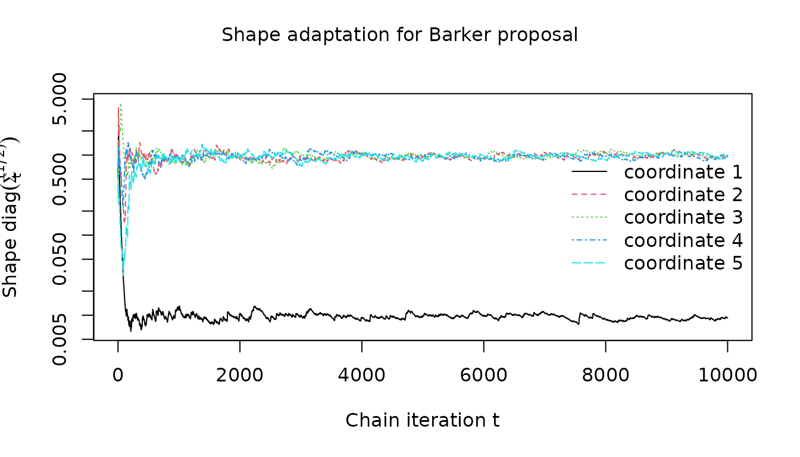
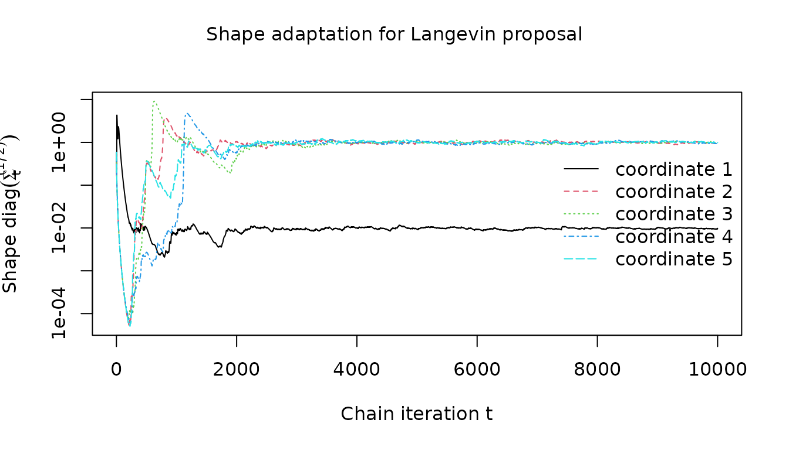
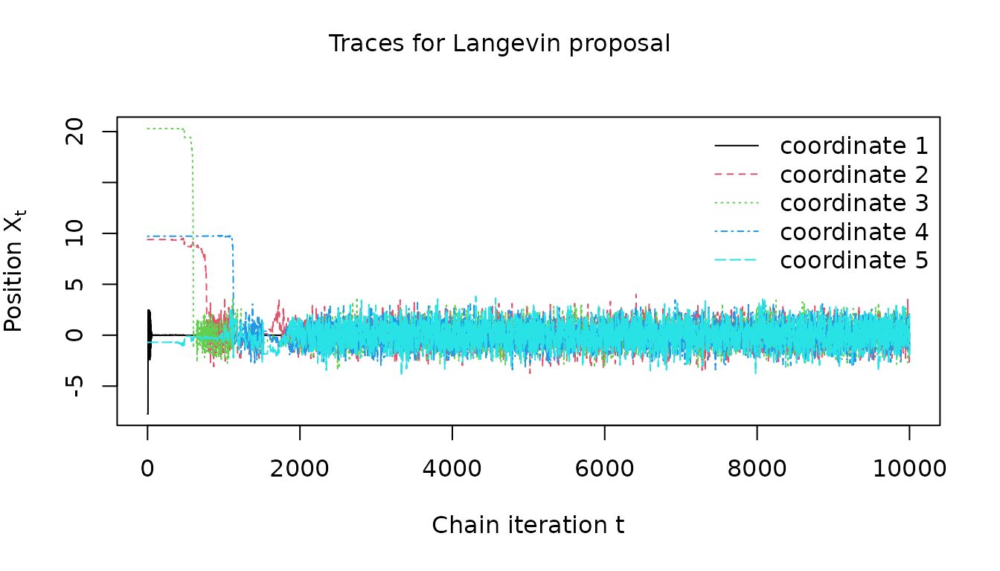

# Robust gradient-based MCMC with the Barker proposal

The `rmcmc` package provides a general-purpose implementation of the
Barker proposal ([Barker 1965](#ref-barker1965monte)), a gradient-based
Markov chain Monte Carlo (MCMC) algorithm inspired by the Barker
accept-reject rule, proposed by Livingstone and Zanella
([2022](#ref-livingstone2022barker)). This vignette demonstrates how to
use the package to sample Markov chains from a target distribution of
interest, and illustrates the robustness to tuning that is a key
advantage of the Barker proposal compared to alternatives such as the
Metropolis adjusted Langevin algorithm (MALA).

``` r
library(rmcmc)
```

## Example target distribution

``` r
dimension <- 10
scales <- c(0.01, rep(1, dimension - 1))
```

As a simple example of a target distribution, we consider a
10-dimensional Gaussian target with heterogeneous scales such that the
standard deviation of the first coordinate is 0.01 and that of other
coordinates is 1. The `rmcmc` package expects the target distribution to
be specified by a function evaluating the logarithm of the (potentially
unnormalized) probability density at a point, and for gradient-based
methods such as the Barker proposal, additionally requires specification
of a function evaluating the gradient of this log density function. The
two functions should be wrapped in to a list under the names
`log_density` and `gradient_log_density` respectively.

``` r
target_distribution <- list(
  log_density = function(x) -sum((x / scales)^2) / 2,
  gradient_log_density = function(x) -x / scales^2
)
```

## Creating proposal distribution

`rmcmc` provides implementations of several different proposal
distributions which can be used within a Metropolis–Hastings based MCMC
method:

- [`barker_proposal()`](http://github-pages.ucl.ac.uk/rmcmc/reference/barker_proposal.md):
  The robust gradient-based Barker proposal proposed by Livingstone and
  Zanella ([2022](#ref-livingstone2022barker)).
- [`langevin_proposal()`](http://github-pages.ucl.ac.uk/rmcmc/reference/langevin_proposal.md):
  A gradient-based proposal based on a discretization of Langevin
  dynamics.
- [`hamiltonian_proposal()`](http://github-pages.ucl.ac.uk/rmcmc/reference/hamiltonian_proposal.md):
  A gradient-based proposal based on a discretization of Hamiltonian
  dynamics, simulated for a fixed number of integrator steps. With a
  single integrator step equivalent to `langevin_proposal`.
- [`random_walk_proposal()`](http://github-pages.ucl.ac.uk/rmcmc/reference/random_walk_proposal.md):
  A Gaussian random-walk proposal.

Each function takes optional arguments which can be used to customize
the behaviour of the proposal such as the scalar `scale` of the
proposal, a vector or matrix defining the proposal `shape` and routines
to sample the auxiliary variables used in the proposal.

Here we create an instance of the Barker proposal, using the default
values of all arguments. Rather than specifying fixed `scale` and
`shape` tuning parameters, in the next section we illustrate how to set
up adaptation of these parameters during a warm-up stage to the chains.

``` r
proposal <- barker_proposal()
```

## Setting up adaptation of tuning parameters

`rmcmc` has support for adaptively tuning parameters of the proposal
distribution. This is mediated by ‘adapter’ objects which define method
for update the parameters of a proposal based on the chain state and
statistics recorded during a chain iteration. Below we instantiate a
list of adapters to (i) adapt the scalar scale of the proposal
distribution to coerce the average acceptance probability of the chain
transitions to a target value, and (ii) adapt the shape of the proposal
distribution with per-coordinate scaling factors based on estimates on
the coordinate-wise variances under the target distribution.

``` r
adapters <- list(
  scale_adapter(
    algorithm = "stochastic_approximation",
    initial_scale = dimension^(-1 / 6),
    target_accept_prob = 0.574,
    kappa = 0.6
  ),
  shape_adapter(type = "variance", kappa = 0.6)
)
```

Here we set the initial scale to
$\mathcal{O}\left( \text{dimension}^{- \frac{1}{6}} \right)$ and the
target acceptance probability to 0.574 following the guidelines in
Vogrinc, Livingstone, and Zanella ([2023](#ref-vogrinc2023optimal)).
This is equivalent to the default behaviour when not specifying the
`initial_scale` and `target_accept_prob` arguments, in which case
proposal and dimension dependent values following the guidelines in
Vogrinc, Livingstone, and Zanella ([2023](#ref-vogrinc2023optimal)) will
be used. Both adapters have an optional `kappa` argument which can be
used to set the decay rate exponent for the adaptation learning rate. We
set this to 0.6, following the recommendation in Livingstone and Zanella
([2022](#ref-livingstone2022barker)), in both cases.

The adapter updates will be applied only during an initial set of
‘warm-up’ chain iterations, with the proposal parameters remaining fixed
to their final adapted values during a subsequent set of main chain
iterations.

## Sampling a chain

To sample a chain we first need to specify the initial chain state. The
`rmcmc` package encapsulates the chain state in a list which tracks the
current position of the chain, but also additional quantities such as
the auxiliary variables used to generate the proposed perturbation to
the state, and cached values of the log density and its gradient once
computed once at the current position to avoid re-computation. The
\[chain_state()\] function allows creation of a list of the required
format, with the first (and only required) argument specifying the
position. Alternatively we can directly pass a vector specifying just
the position component of the state to the `initial_state` argument of
\[sample_chain()\]. Here we generate an initial state with position
coordinates sampled from a independent normal distributions with
standard deviation 10, following the example in Livingstone and Zanella
([2022](#ref-livingstone2022barker)). For reproducibility we also fix
the random seed.

``` r
set.seed(791285301L)
initial_state <- chain_state(10 * rnorm(dimension))
```

We now have everything needed to sample a Markov chain. To do this we
use the `sample_chain` function from `rmcmc`. This requires us to
specify the target distribution, proposal distribution, initial chain
state, number of adaptive warm-up iterations and non-adaptive main chain
iterations and list of adapters to use.

``` r
n_warm_up_iteration <- 10000
n_main_iteration <- 10000
```

Here we sample a chain with $10^{4}$ warm-up and $10^{4}$ main chain
iterations. We set `trace_warm_up` to `TRUE` to record statistics during
the adaptive warm-up chain iterations.

``` r
barker_results <- sample_chain(
  target_distribution = target_distribution,
  proposal = proposal,
  initial_state = initial_state,
  n_warm_up_iteration = n_warm_up_iteration,
  n_main_iteration = n_main_iteration,
  adapters = adapters,
  trace_warm_up = TRUE
)
```

If the `progress` package is installed a progress bar will show the
chain progress during sampling. The return value of `sample_chains` is a
list containing fields for accessing the final chain state (which can be
used to start sampling a new chain), any variables traced during the
main chain iterations and any additional statistics recorded during the
main chain iterations. If the `trace_warm_up` argument to
`sample_chains` is set to `TRUE` as above, then the list returned by
`sample_chains` will also contain entries `warm_up_traces` and
`warm_up_statistics` corresponding to respectively the variable traces
and additional statistics recorded during the warm-up iterations.

One of the additional statistics recorded is the acceptance probability
for each chain iteration under the name `accept_prob`. We can therefore
compute the mean acceptance probability of the main chain iterations as
follows:

``` r
mean_accept_prob <- mean(barker_results$statistics[, "accept_prob"])
cat(sprintf("Average acceptance probability is %.2f", mean_accept_prob))
#> Average acceptance probability is 0.54
```

This is close to the target acceptance rate of 0.574 indicating the
scale adaptation worked as expected.

We can also inspect the shape parameter of the proposal to check the
variance based shape adaptation succeeded. The below snippet extracts
the (first few dimensions of the) adapted shape from the `proposal`
object and compares to the known true scales (per-coordinate standard
deviations) of the target distribution.

``` r
clipped_dimension <- min(5, dimension)
final_shape <- proposal$parameters()$shape
cat(
  sprintf("Adapter scale est.: %s", toString(final_shape[1:clipped_dimension])),
  sprintf("True target scales: %s", toString(scales[1:clipped_dimension])),
  sep = "\n"
)
#> Adapter scale est.: 0.00922080029766185, 0.995077611400515, 0.975164196791254, 0.938742004951002, 0.959131700160353
#> True target scales: 0.01, 1, 1, 1, 1
```

Again adaptation appears to have been successful with the adapted shape
close to the true target scales.

## Summarizing results using `posterior` package

The output from `sample_chains` can also be easily used with external
packages for analyzing MCMC outputs. For example the [`posterior`
package](https://mc-stan.org/posterior/index.html) provides
implementations of various inference diagnostic and functions for
manipulating, subsetting and summarizing MCMC outputs.

``` r
library(posterior)
#> This is posterior version 1.6.1
#> 
#> Attaching package: 'posterior'
#> The following objects are masked from 'package:stats':
#> 
#>     mad, sd, var
#> The following objects are masked from 'package:base':
#> 
#>     %in%, match
```

The `traces` entry in the returned (list) output from `sample_chain` is
a matrix with row corresponding to the chain iterations and (named)
columns the traced variables. This matrix can be directly coerced to the
`draws` data format the `posterior` package internally uses to represent
chain outputs, and so can be passed directly to the [`summarize_draws`
function](https://mc-stan.org/posterior/reference/draws_summary.html) to
output a `tibble` data frame containing a set of summary statistics and
diagnostic measures for each variable.

``` r
summarize_draws(barker_results$traces)
#> # A tibble: 11 × 10
#>    variable           mean   median     sd    mad      q5     q95  rhat ess_bulk
#>    <chr>             <dbl>    <dbl>  <dbl>  <dbl>   <dbl>   <dbl> <dbl>    <dbl>
#>  1 position1       1.63e-4  3.51e-4 0.0102 0.0104 -0.0166  0.0169 1.00     1197.
#>  2 position2      -3.07e-2 -9.21e-3 1.01   0.990  -1.72    1.62   1.00     1405.
#>  3 position3       2.22e-2  1.54e-2 1.01   1.01   -1.61    1.64   1.000    1191.
#>  4 position4       2.13e-2  1.25e-2 1.02   1.04   -1.68    1.68   1.000    1250.
#>  5 position5       1.78e-2  2.02e-2 0.993  1.01   -1.63    1.62   1.00     1370.
#>  6 position6      -2.23e-2 -3.13e-2 1.01   0.996  -1.67    1.65   1.00     1157.
#>  7 position7       2.99e-2  4.19e-3 1.00   1.01   -1.59    1.69   1.00     1456.
#>  8 position8       2.38e-2 -4.45e-3 1.02   1.01   -1.63    1.75   1.00     1503.
#>  9 position9      -3.08e-2 -3.23e-2 1.01   1.02   -1.67    1.62   1.00     1478.
#> 10 position10      2.73e-2  1.43e-2 1.01   1.02   -1.61    1.67   1.00     1482.
#> 11 target_log_de… -5.11e+0 -4.71e+0 2.34   2.17   -9.43   -2.00   1.00     1188.
#> # ℹ 1 more variable: ess_tail <dbl>
```

We can also first explicit convert the `traces` matrix to a `posterior`
draws object using the `as_draws_matrix` function. This can be passed to
the `summary` generic function to get an equivalent output

``` r
draws <- as_draws_matrix(barker_results$traces)
summary(draws)
#> # A tibble: 11 × 10
#>    variable           mean   median     sd    mad      q5     q95  rhat ess_bulk
#>    <chr>             <dbl>    <dbl>  <dbl>  <dbl>   <dbl>   <dbl> <dbl>    <dbl>
#>  1 position1       1.63e-4  3.51e-4 0.0102 0.0104 -0.0166  0.0169 1.00     1197.
#>  2 position2      -3.07e-2 -9.21e-3 1.01   0.990  -1.72    1.62   1.00     1405.
#>  3 position3       2.22e-2  1.54e-2 1.01   1.01   -1.61    1.64   1.000    1191.
#>  4 position4       2.13e-2  1.25e-2 1.02   1.04   -1.68    1.68   1.000    1250.
#>  5 position5       1.78e-2  2.02e-2 0.993  1.01   -1.63    1.62   1.00     1370.
#>  6 position6      -2.23e-2 -3.13e-2 1.01   0.996  -1.67    1.65   1.00     1157.
#>  7 position7       2.99e-2  4.19e-3 1.00   1.01   -1.59    1.69   1.00     1456.
#>  8 position8       2.38e-2 -4.45e-3 1.02   1.01   -1.63    1.75   1.00     1503.
#>  9 position9      -3.08e-2 -3.23e-2 1.01   1.02   -1.67    1.62   1.00     1478.
#> 10 position10      2.73e-2  1.43e-2 1.01   1.02   -1.61    1.67   1.00     1482.
#> 11 target_log_de… -5.11e+0 -4.71e+0 2.34   2.17   -9.43   -2.00   1.00     1188.
#> # ℹ 1 more variable: ess_tail <dbl>
```

The draws object can also be manipulated and subsetted with various
functions provided by `posterior`. For example the [`extract_variable`
function](https://mc-stan.org/posterior/reference/extract_variable.html)
can be used to extract the draws for a specific named variable. The
output from this function can then be passed to the various diagnostic
functions, for example to compute the effective sample size of the mean
of the `target_log_density` variable we could do the following

``` r
cat(
  sprintf(
    "Effective sample size of mean(target_log_density) is %.0f",
    ess_mean(extract_variable(draws, "target_log_density"))
  )
)
#> Effective sample size of mean(target_log_density) is 1206
```

## Sampling using a Langevin proposal

To sample a chain using a Langevin proposal, we can simply use
`langevin_proposal` in place of `baker_proposal`.

Here we create a new set of adapters using the default
`target_accept_prob` argument to `scale_adapter` which will set the
target acceptance rate to the Langevin proposal optimal value of 0.574
following the results in Roberts and Rosenthal
([2001](#ref-roberts2001optimal)).

``` r
mala_results <- sample_chain(
  target_distribution = target_distribution,
  proposal = langevin_proposal(),
  initial_state = initial_state,
  n_warm_up_iteration = n_warm_up_iteration,
  n_main_iteration = n_main_iteration,
  adapters = list(
    scale_adapter(algorithm = "stochastic_approximation", kappa = 0.6),
    shape_adapter(type = "variance", kappa = 0.6)
  ),
  trace_warm_up = TRUE
)
```

We can again check the average acceptance rate of the main chain
iterations is close to the specified target value:

``` r
cat(
  sprintf(
    "Average acceptance probability is %.2f",
    mean(mala_results$statistics[, "accept_prob"])
  )
)
#> Average acceptance probability is 0.61
```

and use the `ess_mean` function from the `posterior` package to compute
the effective sample size of the mean of the `target_log_density`
variable

``` r
cat(
  sprintf(
    "Effective sample size of mean(target_log_density) is %.0f",
    ess_mean(
      extract_variable(
        as_draws_matrix(mala_results$traces), "target_log_density"
      )
    )
  )
)
#> Effective sample size of mean(target_log_density) is 2863
```

## Comparing adaptation using Barker and Langevin proposal

We can plot how the proposal shape and scale parameters varied during
the adaptive warm-up iterations, by accessing the statistics recorded in
the `warm_up_statistics` entry in the list returned by `sample_chain`.

``` r
visualize_scale_adaptation <- function(warm_up_statistics, label) {
  n_warm_up_iteration <- nrow(warm_up_statistics)
  old_par <- par(mfrow = c(1, 2))
  on.exit(par(old_par))
  plot(
    exp(warm_up_statistics[, "log_scale"]),
    type = "l",
    xlab = expression(paste("Chain iteration ", t)),
    ylab = expression(paste("Scale ", sigma[t]))
  )
  plot(
    cumsum(warm_up_statistics[, "accept_prob"]) / 1:n_warm_up_iteration,
    type = "l",
    xlab = expression(paste("Chain iteration ", t)),
    ylab = expression(paste("Average acceptance rate ", alpha[t])),
    ylim = c(0, 1)
  )
  mtext(
    sprintf("Scale adaptation for %s", label),
    side = 3, line = -2, outer = TRUE
  )
}
```

First considering the scalar scale parameter $\sigma_{t}$, which is
controlled to achieve a target average acceptance rate, we see that for
Barker proposal the adaptation successfully coerces the average
acceptance rate to be close to the 0.574 target value and that the scale
parameter adaptation has largely stabilized within the first 1000
iterations.

``` r
visualize_scale_adaptation(barker_results$warm_up_statistics, "Barker proposal")
```


For the Langevin proposal on the other hand, while the acceptance rate
does eventually converge to its target value of 0.574, the convergence
is slower and there is more evidence of unstable oscillatory behaviour
in the adapted scale.

``` r
visualize_scale_adaptation(mala_results$warm_up_statistics, "Langevin proposal")
```


Now we consider the adaptation of the diagonal shape matrix
$\Sigma_{t}$, based on estimates of the per-coordinate variances.

``` r
visualize_shape_adaptation <- function(warm_up_statistics, dimensions, label) {
  matplot(
    sqrt(warm_up_statistics[, paste0("variance_estimate", dimensions)]),
    type = "l",
    xlab = expression(paste("Chain iteration ", t)),
    ylab = expression(paste("Shape ", diag(Sigma[t]^(1 / 2)))),
    log = "y"
  )
  legend(
    "right",
    paste0("coordinate ", dimensions),
    lty = dimensions,
    col = dimensions,
    bty = "n"
  )
  mtext(
    sprintf("Shape adaptation for %s", label),
    side = 3, line = -2, outer = TRUE
  )
}
```

We see that the for the Barker proposal the adaptation quickly converges
towards the known heterogeneous scales along the different coordinates.

``` r
visualize_shape_adaptation(
  barker_results$warm_up_statistics, 1:clipped_dimension, "Barker proposal"
)
```



For the Langevin proposal, the shape adaptation is again slower.

``` r
visualize_shape_adaptation(
  mala_results$warm_up_statistics, 1:clipped_dimension, "Langevin proposal"
)
```



We can also visualize the chain position components during the warm-up
iterations using the `warm_up_traces` entry.

``` r
visualize_traces <- function(traces, dimensions, label) {
  matplot(
    traces[, paste0("position", dimensions)],
    type = "l",
    xlab = expression(paste("Chain iteration ", t)),
    ylab = expression(paste("Position ", X[t])),
  )
  legend(
    "topright",
    paste0("coordinate ", dimensions),
    lty = dimensions,
    col = dimensions,
    bty = "n"
  )
  mtext(sprintf("Traces for %s", label), side = 3, line = -2, outer = TRUE)
}
```

For the Barker proposal we can see the chain quickly appears to converge
to a stationary regime

``` r
visualize_traces(
  barker_results$warm_up_traces, 1:clipped_dimension, "Barker proposal"
)
```


The Langevin proposal does also appear to converge to a stationary
regime but again convergence is slower

``` r
visualize_traces(
  mala_results$warm_up_traces, 1:clipped_dimension, "Langevin proposal"
)
```



Overall we see that while the Langevin proposal is able to achieve a
higher sampling efficiency when tuned with appropriate parameters, its
performance is more sensitive to the tuning parameter values resulting
in less stable and robust adaptive tuning.

## References

Barker, Anthony Alfred. 1965. “Monte Carlo calculations of the radial
distribution functions for a proton electron plasma.” *Australian
Journal of Physics* 18 (2): 119–34.

Livingstone, Samuel, and Giacomo Zanella. 2022. “The Barker proposal:
combining robustness and efficiency in gradient-based MCMC.” *Journal of
the Royal Statistical Society Series B: Statistical Methodology* 84 (2):
496–523. <https://doi.org/10.1111/rssb.12482>.

Roberts, Gareth O, and Jeffrey S Rosenthal. 2001. “Optimal scaling for
various Metropolis-Hastings algorithms.” *Statistical Science* 16 (4):
351–67.

Vogrinc, Jure, Samuel Livingstone, and Giacomo Zanella. 2023. “Optimal
Design of the Barker Proposal and Other Locally Balanced
Metropolis–Hastings Algorithms.” *Biometrika* 110 (3): 579–95.
