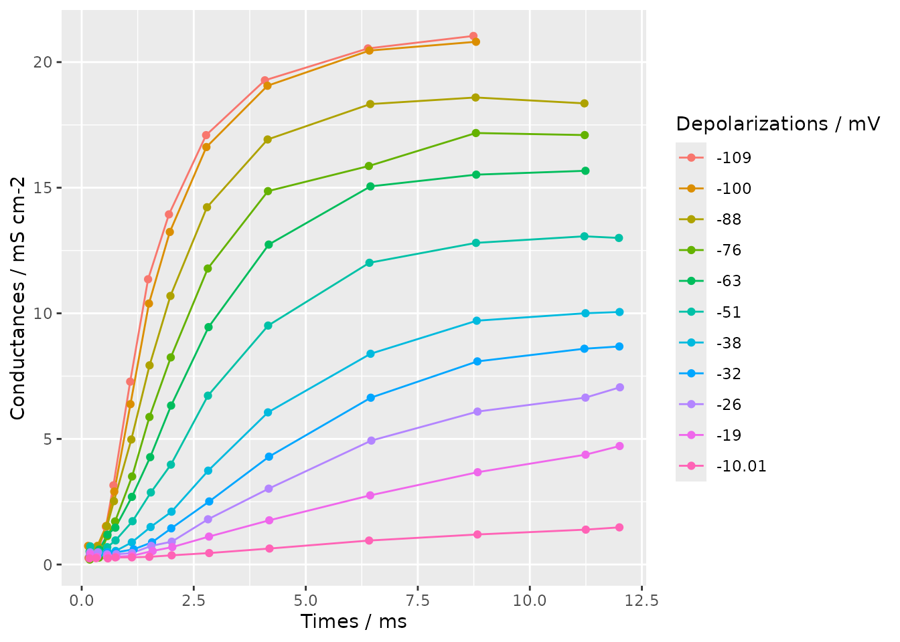
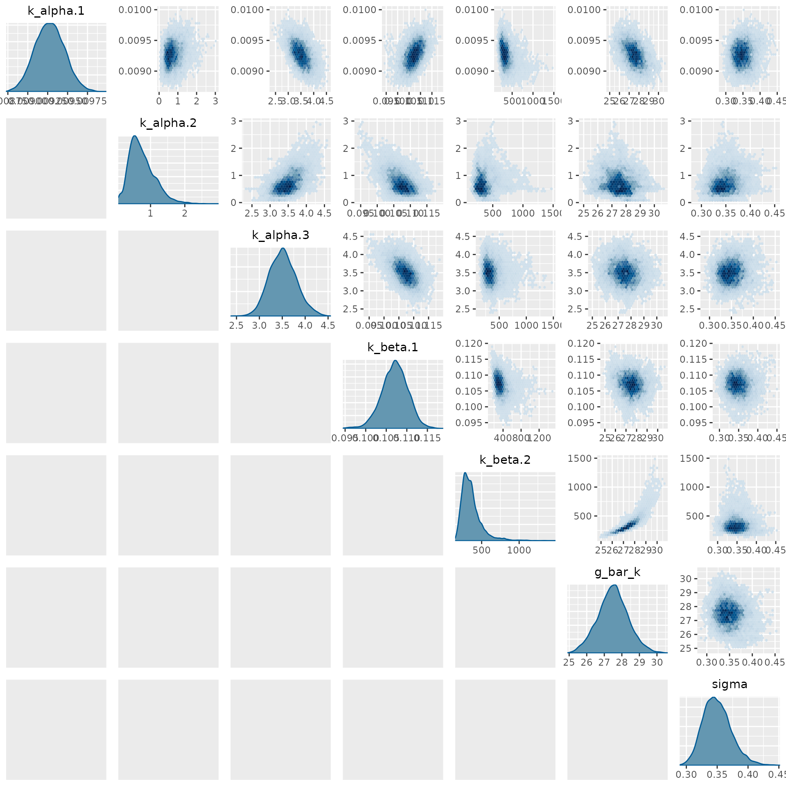

# Interfacing with Stan models via BridgeStan

The `rmcmc` package includes support for using the probabilistic
programming language Stan to define the target distribution for
inference via the [R interface of the excellent BridgeStan
package](https://roualdes.us/bridgestan/latest/languages/r.html). This
article illustrates how to use the Stan modelling syntax to define a
model to use with `rmcmc` using an example model and data from
computational neuroscience.

``` r
library(rmcmc)
```

## Hodgkin-Huxley model for action potential generation

We will use as an example a mathematical model describing how action
potentials in neurons are generated and how we might fit that model to
data. The [model of
interest](https://en.wikipedia.org/wiki/Hodgkin%E2%80%93Huxley_model)
was described by Hodgkin and Huxley ([1952](#ref-hodgkin1952currents))
based on experimental investigations with squid giant axons. They
received the Nobel Prize in Physiology or Medicine for their work in
1963. We will fit the model here to a digitisation of the data the
original experiments from Daly et al. ([2015](#ref-daly2015hodgkin)).

The [cell membrane voltage
$V_{m}$](https://en.wikipedia.org/wiki/Membrane_potential) is modelled
as being controlled by [voltage-gated ion
channels](https://en.wikipedia.org/wiki/Voltage-gated_ion_channel), with
governing [ordinary differential equation
(ODE)](https://en.wikipedia.org/wiki/Ordinary_differential_equation)

$$C_{m}\frac{dV_{m}}{dt} = g_{K}\left( E_{K} - V_{m} \right) + g_{Na}\left( E_{Na} - V_{m} \right) + g_{L}\left( E_{l} - V_{m} \right) - I.$$

where

- $C_{m}$ is the membrane capacitance per unit area,
- $g_{K}$ is the potassium channel conductance,
- $E_{k}$ the potassium channel reversal potential,
- $g_{Na}$ is the sodium channel conductance,
- $E_{Na}$ is the sodium channel reversal potential,
- $g_{L}$ is the leakage conductance,
- $E_{L}$ is the leakage reversal potential,
- and $I$ is the membrane current per unit area.

Importantly the potassium and sodium channel conductances, $g_{K}$ and
$g_{Na}$, are themselves time and voltage dependent variables. In
Hodgkin and Huxley’s experiments they used an ingenious [experimental
protocol](https://en.wikipedia.org/wiki/Voltage_clamp) to allow
measuring the evolution of the cell membrane’s conductance over time for
specific ion channels while clamped to a specific depolarization
voltage. By varying the extracellular ion concentrations, they were able
to isolate the effects of the potassium and sodium channels. Here we
will concentrate on the model and data specifically for $g_{K}$, the
potassium channel conductance.

The potassium channel conductance is modelled as

$$g_{\text{K}}(t,v,\theta) = {\bar{g}}_{\text{K}}n(t,v,\theta)^{4},$$

where

- ${\bar{g}}_{K}$ is the maximum potassium channel conductance,
- $n$ is a time and voltage dependent subunit activation probability in
  $\lbrack 0,1\rbrack$,
- $v = V_{\text{rest}} - V_{m}$ is the depolarization from the resting
  potential $V_{\text{rest}}$ in mV
- and
  $\theta = \left( {\bar{g}}_{K},k_{\alpha,1},k_{\alpha,2},k_{\alpha,3},k_{\beta,1},k_{\beta,2} \right)$
  are a set of model parameters.

The potassium channel subunit activation $n$ is governed by a linear ODE

$$\frac{dn(t,v,\theta)}{dt} = \frac{n_{\infty}(v,\theta) - n(t,v,\theta)}{\tau(v,\theta)}$$

which has the analytic solution

$$n(t,v,\theta) = n(0,v,\theta) + \left( n_{\infty}(v,\theta) - n(0,v,\theta) \right)\left( 1 - \exp\left( - t/\tau(v,\theta) \right) \right).$$

The time constant $\tau$ and equilibrium value $n_{\infty}$ are defined
respectively in terms of rate constant functions $\alpha$ and $\beta$ as

$$\tau(v,\theta) = \frac{1}{\alpha(v,\theta) + \beta(v,\theta)},\quad n_{\infty}(v,\theta) = \frac{\alpha(v,\theta)}{\alpha(v,\theta) + \beta(v,\theta)}.$$

The rate constants $\alpha$ and $\beta$ are themselves defined
respectively in terms of the model parameters as

$$\alpha(v,{\mathbf{θ}}) = \frac{k_{\alpha,1}\left( v + k_{\alpha,2} \right)}{\exp\left( \left( v + k_{\alpha,2} \right)/k_{\alpha,3} \right) - 1},\quad\beta(v,{\mathbf{θ}}) = k_{\beta,1}\exp\left( v/k_{\beta,2} \right).$$

Together these equations define a mathematical model for how the
potassium conductance $g_{K}$ varies as a function of the applied
depolarization and time, with six unknown model parameters
$\theta = \left( k_{\alpha,1},k_{\alpha,2},k_{\alpha,3},k_{\beta,1},k_{\beta,2},{\bar{g}}_{K} \right)$
that need to be inferred from the experimental data. In Hodgkin and
Huxley’s experiments, the potassium conductances were measured at
regular time intervals for a series of applied depolarizations. We
assume here that the recorded conductances are subject to independent
zero-mean Gaussian noise with an unknown standard deviation $\sigma$,
that is

$$y_{n} \sim {\mathsf{N}\mathsf{o}\mathsf{r}\mathsf{m}\mathsf{a}\mathsf{l}}\left( g_{K}\left( t_{n},v_{n},\theta \right),\sigma \right)\quad\forall n \in 1:N,$$

where $t_{n}$ and $v_{n}$ are the pairs of measurement times and applied
depolarization voltages for the measured potassium conductance $y_{n}$.

Altogether then we have seven parameters
$\left( k_{\alpha,1},k_{\alpha,2},k_{\alpha,3},k_{\beta,1},k_{\beta,2},{\bar{g}}_{K},\sigma \right)$
to infer. All parameters here are constrained to be non-negative. We
assume that they are apriori independent with weakly-informative log
normal prior distributions that correspond to beliefs about the typical
plausible magnitudes of these parameters:

$$\begin{aligned}
k_{\alpha,1} & {\sim {\mathsf{L}\mathsf{o}\mathsf{g}\mathsf{N}\mathsf{o}\mathsf{r}\mathsf{m}\mathsf{a}\mathsf{l}}( - 3,1),} \\
k_{\alpha,2} & {\sim {\mathsf{L}\mathsf{o}\mathsf{g}\mathsf{N}\mathsf{o}\mathsf{r}\mathsf{m}\mathsf{a}\mathsf{l}}(2,1),} \\
k_{\alpha,3} & {\sim {\mathsf{L}\mathsf{o}\mathsf{g}\mathsf{N}\mathsf{o}\mathsf{r}\mathsf{m}\mathsf{a}\mathsf{l}}(2,1),} \\
k_{\beta,1} & {\sim {\mathsf{L}\mathsf{o}\mathsf{g}\mathsf{N}\mathsf{o}\mathsf{r}\mathsf{m}\mathsf{a}\mathsf{l}}( - 3,1),} \\
k_{\beta,2} & {\sim {\mathsf{L}\mathsf{o}\mathsf{g}\mathsf{N}\mathsf{o}\mathsf{r}\mathsf{m}\mathsf{a}\mathsf{l}}(2,1),} \\
{\bar{g}}_{K} & {\sim {\mathsf{L}\mathsf{o}\mathsf{g}\mathsf{N}\mathsf{o}\mathsf{r}\mathsf{m}\mathsf{a}\mathsf{l}}(2,1),} \\
\sigma & {\sim {\mathsf{L}\mathsf{o}\mathsf{g}\mathsf{N}\mathsf{o}\mathsf{r}\mathsf{m}\mathsf{a}\mathsf{l}}(0,1).}
\end{aligned}$$

## Stan implementation

[Stan’s high-level modelling
syntax](https://mc-stan.org/docs/reference-manual/) makes it easy to
translate the above mathematical model to an efficient numerical
implementation. Importantly for our purposes, due to Stan’s support for
algorithmic differentiation, we will be able to automatically compute
derivatives for the resulting model functions.

We first declare a series of [user-defined
functions](https://mc-stan.org/docs/reference-manual/user-functions.html)
in the `functions` block of a Stan model file, corresponding to the
various functions defined symbolically in the previous section.

    functions {
      vector alpha_k(vector v, vector k_alpha) {
        return k_alpha[1] .* (v + k_alpha[2])
               ./ (exp((v + k_alpha[2]) ./ k_alpha[3]) - 1);
      }
      vector beta_k(vector v, vector k_beta) {
        return k_beta[1] .* exp(v ./ k_beta[2]);
      }
      vector n_infty(vector v, vector k_alpha, vector k_beta) {
        return alpha_k(v, k_alpha) ./ (alpha_k(v, k_alpha) + beta_k(v, k_beta));
      }
      vector tau_n(vector v, vector k_alpha, vector k_beta) {
        return 1 ./ (alpha_k(v, k_alpha) + beta_k(v, k_beta));
      }
      vector potassium_channel_subunit_activation(
        vector t, vector v, vector k_alpha, vector k_beta
      ) {
        real n_0 = n_infty([0.0]', k_alpha, k_beta)[1]; // Assume starting from equilibrium
        return n_0
               + (n_infty(v, k_alpha, k_beta) - n_0)
                 .* (1 - exp(-t ./ tau_n(v, k_alpha, k_beta)));
      }
      vector potassium_conductance(
        vector t, vector v, real g_bar_k, vector k_alpha, vector k_beta, int N
      ) {
        vector[N] n = potassium_channel_subunit_activation(t, v, k_alpha, k_beta);
        return g_bar_k .* n .^ 4;
      }
    }

In [the `data`
block](https://mc-stan.org/docs/reference-manual/blocks.html#program-block-data)
we declare the names, types and dimensions of the data values that will
be read from the passed data file. Here the data consists of three
one-dimensional arrays (vectors) each of length $N = 136$, corresponding
to the measurement times (`times`, unit *ms*), depolarizations applied
to the axons (`depolarizations`, unit *mV*) and measured conductances
(`conductances`, unit *mS cm^{-1}*).

    data {
      int<lower=1> N;
      vector[N] times;
      vector[N] depolarizations;
      vector[N] conductances;
    }

In [the `parameter`
block](https://mc-stan.org/docs/reference-manual/blocks.html#program-block-parameters)
we declare the name, types, dimensions and any constraints on the model
parameters that we will be inferring. Here the rate constant parameters
$k_{\alpha}$ and $k_{\beta}$ are declared as vectors of dimension 3 and
2 respectively. All parameters here are non-negative and so a `lower=0`
constraint is added to indicate to Stan to [transform these constrained
parameters to an unconstrained representation suitable for
sampling](https://mc-stan.org/docs/reference-manual/transforms.html).

    parameters {
      vector<lower=0>[3] k_alpha;
      vector<lower=0>[2] k_beta;
      real<lower=0> g_bar_k;
      real<lower=0> sigma;
    }

We are now ready to put everything together in [the `model`
block](https://mc-stan.org/docs/reference-manual/blocks.html#program-block-model).
We first define the log-normal prior distributions on all the model
parameters. We then call the earlier defined `potassium_conductance`
function to compute the simulated potassium conductance values given the
measurement times and depolarizations from the data and parameter
values. Finally we specify that the observed conductance values are
subject to independent normal observation noise.

    model {
      //priors
      k_alpha[1] ~ lognormal(-3, 1);
      k_alpha[2] ~ lognormal(2, 1);
      k_alpha[3] ~ lognormal(2, 1);
      k_beta[1] ~ lognormal(-3, 1);
      k_beta[2] ~ lognormal(2, 1);
      g_bar_k ~ lognormal(2, 1);
      sigma ~ lognormal(0, 1);
      // Solve model to simulate conductances
      vector[N] simulated_conductances = potassium_conductance(
        times, depolarizations, g_bar_k, k_alpha, k_beta, N
      );
      // likelihood
      conductances ~ normal(simulated_conductances, sigma);
    }

## Data

The data we will use to fit the model is a from a digitisation of the
experimental data from Hodgkin and Huxley
([1952](#ref-hodgkin1952currents)) due to Daly et al.
([2015](#ref-daly2015hodgkin)). The data has been written in JSON format
to a file `hodgkin-huxley-potassium-data.json`, with contents

    {
      "N": 136,
      "times": [
            0.151969,  0.346818,  0.540928,  0.708482,  1.08186 ,  1.48128 ,
            1.94706 ,  2.77638 ,  4.08767 ,  6.38795 ,  8.74094 ,  0.143946,
            0.351982,  0.546323,  0.727155,  1.08817 ,  1.50074 ,  1.96633 ,
            2.78252 ,  4.14563 ,  6.41981 ,  8.79894 ,  0.166009,  0.360627,
            0.564685,  0.719812,  1.10767 ,  1.51457 ,  1.98016 ,  2.79612 ,
            4.14918 ,  6.43957 ,  8.78951 , 11.2179  ,  0.181155,  0.38587 ,
            0.570391,  0.745402,  1.12413 ,  1.51208 ,  1.9878  ,  2.81355 ,
            4.15654 ,  6.40831 ,  8.79632 , 11.2246  ,  0.176417,  0.390884,
            0.575647,  0.750935,  1.12043 ,  1.52861 ,  1.99489 ,  2.8308  ,
            4.17366 ,  6.44379 ,  8.80331 , 11.2411  ,  0.189592,  0.384833,
            0.569941,  0.754981,  1.1346  ,  1.54314 ,  1.99071 ,  2.81711 ,
            4.16031 ,  6.42045 ,  8.79916 , 11.2174  , 11.9878  ,  0.192635,
            0.387599,  0.582563,  0.758058,  1.11856 ,  1.53733 ,  2.00485 ,
            2.8225  ,  4.15637 ,  6.4459  ,  8.81437 , 11.2423  , 12.0029  ,
            0.185443,  0.351221,  0.565688,  0.750969,  1.16043 ,  1.56976 ,
            1.99835 ,  2.84581 ,  4.18023 ,  6.45033 ,  8.82848 , 11.2172  ,
           11.9973  ,  0.187172,  0.362701,  0.567555,  0.77234 ,  1.12336 ,
            1.5522  ,  2.01038 ,  2.81901 ,  4.17345 ,  6.46347 ,  8.83215 ,
           11.2404  , 12.0104  ,  0.189039,  0.345169,  0.579174,  0.774242,
            1.12527 ,  1.58342 ,  2.02211 ,  2.84087 ,  4.18601 ,  6.43774 ,
            8.83581 , 11.2438  , 12.0042  ,  0.174412,  0.320652,  0.583981,
            0.749621,  1.12018 ,  1.51018 ,  2.00731 ,  2.84564 ,  4.19074 ,
            6.41301 ,  8.83059 , 11.2483  , 11.9989
      ],
      "depolarizations": [
           -109.0  , -109.0 , -109.0 , -109.0 , -109.0  , -109.0  , -109.0  ,
           -109.0  , -109.0  , -109.0  , -109.0  , -100.0  , -100.0  , -100.0  ,
           -100.0  , -100.0  , -100.0  , -100.0  , -100.0  , -100.0  , -100.0  ,
           -100.0  ,  -88.0  ,  -88.0  ,  -88.0  ,  -88.0  ,  -88.0  ,  -88.0  ,
            -88.0  ,  -88.0  ,  -88.0  ,  -88.0  ,  -88.0  ,  -88.0  ,  -76.0  ,
            -76.0  ,  -76.0  ,  -76.0  ,  -76.0  ,  -76.0  ,  -76.0  ,  -76.0  ,
            -76.0  ,  -76.0  ,  -76.0  ,  -76.0  ,  -63.0  ,  -63.0  ,  -63.0  ,
            -63.0  ,  -63.0  ,  -63.0  ,  -63.0  ,  -63.0  ,  -63.0  ,  -63.0  ,
            -63.0  ,  -63.0  ,  -51.0  ,  -51.0  ,  -51.0  ,  -51.0  ,  -51.0  ,
            -51.0  ,  -51.0  ,  -51.0  ,  -51.0  ,  -51.0  ,  -51.0  ,  -51.0  ,
            -51.0  ,  -38.0  ,  -38.0  ,  -38.0  ,  -38.0  ,  -38.0  ,  -38.0  ,
            -38.0  ,  -38.0  ,  -38.0  ,  -38.0  ,  -38.0  ,  -38.0  ,  -38.0  ,
            -32.0  ,  -32.0  ,  -32.0  ,  -32.0  ,  -32.0  ,  -32.0  ,  -32.0  ,
            -32.0  ,  -32.0  ,  -32.0  ,  -32.0  ,  -32.0  ,  -32.0  ,  -26.0  ,
            -26.0  ,  -26.0  ,  -26.0  ,  -26.0  ,  -26.0  ,  -26.0  ,  -26.0  ,
            -26.0  ,  -26.0  ,  -26.0  ,  -26.0  ,  -26.0  ,  -19.0  ,  -19.0  ,
            -19.0  ,  -19.0  ,  -19.0  ,  -19.0  ,  -19.0  ,  -19.0  ,  -19.0  ,
            -19.0  ,  -19.0  ,  -19.0  ,  -19.0  ,  -10.01,  -10.01,  -10.01,
            -10.01,  -10.01,  -10.01,  -10.01,  -10.01,  -10.01,  -10.01,
            -10.01,  -10.01,  -10.01
      ],
      "conductances": [
            0.26035 ,  0.469177,  1.50235 ,  3.15343 ,  7.28047 , 11.3564  ,
           13.939   , 17.0936  , 19.2759  , 20.5448  , 21.0415  ,  0.7394  ,
            0.742386,  1.5346  ,  2.90553 ,  6.38418 , 10.3899  , 13.2385  ,
           16.6184  , 19.0589  , 20.4598  , 20.8098  ,  0.25768 ,  0.719578,
            1.526   ,  2.52307 ,  4.97748 ,  7.9296  , 10.6912  , 14.223   ,
           16.9205  , 18.3299  , 18.5922  , 18.3581  ,  0.196537,  0.276938,
            1.13222 ,  1.71605 ,  3.50426 ,  5.87397 ,  8.24492 , 11.7835  ,
           14.8643  , 15.865   , 17.1777  , 17.0957  ,  0.514338,  0.596152,
            1.18937 ,  1.46748 ,  2.6933  ,  4.27401 ,  6.32801 ,  9.45034 ,
           12.7374  , 15.0535  , 15.5203  , 15.6734  ,  0.72418 ,  0.499035,
            0.691458,  0.959828,  1.72454 ,  2.86938 ,  3.97679 ,  6.72229 ,
            9.5129  , 12.0124  , 12.8047  , 13.0659  , 13.0006  ,  0.342299,
            0.420447,  0.498595,  0.538739,  0.883313,  1.49284 ,  2.10304 ,
            3.73692 ,  6.05714 ,  8.39047 ,  9.70601 , 10.0035  , 10.0517  ,
            0.394772,  0.397135,  0.478621,  0.481263,  0.604742,  0.885073,
            1.44017 ,  2.51102 ,  4.29465 ,  6.64062 ,  8.08621 ,  8.59084 ,
            8.68039 ,  0.482695,  0.485248,  0.408227,  0.411206,  0.456312,
            0.742553,  0.90922 ,  1.80099 ,  3.02071 ,  4.93404 ,  6.08851 ,
            6.64355 ,  7.05475 ,  0.410034,  0.301024,  0.341214,  0.306803,
            0.348568,  0.539926,  0.693985,  1.11242 ,  1.76018 ,  2.75348 ,
            3.67468 ,  4.37379 ,  4.71736 ,  0.243338,  0.253563,  0.244784,
            0.284204,  0.285513,  0.306307,  0.366316,  0.456655,  0.636163,
            0.954693,  1.19624 ,  1.38924 ,  1.47927
      ]
    }

Using the `rjson` and `ggplot2` package we can visualize this
conductance data.

``` r
library(rjson)
library(ggplot2)
```

We first read the data from the JSON file in to a data frame.

``` r
data <- data.frame(fromJSON(file = "hodgkin-huxley-potassium-data.json"))
```

We then plot the conductances against measurement times, grouping by the
depolarization level with a different colour for each level.

``` r
ggplot(
  data = data, aes(x = times, y = conductances, colour = factor(depolarizations))
) +
  geom_line() +
  geom_point() +
  labs(
    x = "Times / ms", y = "Conductances / mS cm-2", colour = "Depolarizations / mV"
  )
```



## Fitting model with `rmcmc`

We are now ready to sample from the model’s posterior distribution using
`rmcmc`. We will use BridgeStan to construct a `StanModel` object from
the files defining the Stan model and data.

``` r
library(bridgestan)
```

Before creating the model object, we set a fixed random seed and use it
to seed the global R random number generator state. We will also use
this seed for the (separate) random number generator state used by
BridgeStan.

``` r
seed <- 7861223L
set.seed(seed)
```

We now create our model object, passing the paths to the Stan model file
and JSON data file respectively, as well as our integer seed for the
internal Stan random number generator state.

``` r
model <- StanModel$new(
  "hodgkin-huxley-potassium-model.stan",
  "hodgkin-huxley-potassium-data.json",
  seed
)
```

`rmcmc` requires the initial chain state to be explicitly specified. The
`StanModel` object we just created includes a method `param_unc_num`
which can be used to evaluate the dimension of the unconstrained model
parameter space we will perform inference in. Here we use the arbitrary
choice of initializing with random uniform values on (0, 1) in the
unconstrained space.

``` r
initial_state <- runif(model$param_unc_num())
```

We now have all the components we need to sample a chain using `rmcmc`.
The
[`sample_chain()`](http://github-pages.ucl.ac.uk/rmcmc/reference/sample_chain.md)
function is the main entry point to `rmcmc`. It takes several arguments,
one of the most important of which is the `target_distribution`
specifying the distribution to generate approximate samples for. This
can be supplied in various formats; here we will exploit the ability to
pass a BridgeStan `StanModel` instance directly, with this internally be
mapped through the
[`target_distribution_from_stan_model()`](http://github-pages.ucl.ac.uk/rmcmc/reference/target_distribution_from_stan_model.md)
function. This function can be called explicitly for additional control,
for example customizing whether values defined in the Stan generated
quantities or transformed parameters blocks are included in the traced
chain outputs.

We also pass our sampled initial state and specify to use 100000
iterations for both the initial adaptive warm-up and main (non-adaptive)
sampling stages. A chain of this length takes around a minute to sample
on a laptop. Finally we here explicitly specify the adaptation scheme
used to learn the proposal scale and shape parameters. This overrides
the default choice of using a dense shape matrix based on the estimated
covariances, to instead use a diagonal shape matrix based on just the
estimated variances. This was found to give robuster sampling in
practice here.

``` r
results <- sample_chain(
  target_distribution = model,
  initial_state = initial_state,
  n_warm_up_iteration = 100000,
  n_main_iteration = 100000,
  adapters = list(scale_adapter(), shape_adapter("variance"))
)
```

## Checking results with `posterior`

We can use the `posterior` package to compute summary statistics and
convergence diagnostics for the sampled chain.

``` r
library(posterior)
#> This is posterior version 1.6.1
#> 
#> Attaching package: 'posterior'
#> The following objects are masked from 'package:stats':
#> 
#>     mad, sd, var
#> The following objects are masked from 'package:base':
#> 
#>     %in%, match
```

While the `results$traces` matrix (with rows corresponding to the chain
iterations and column the traced variables) can be passed directly to
main of the functions in the `posterior` package, here we will
explicitly create a draws object to allow using some of the functions
for subsetting the draws.

``` r
draws <- as_draws(results$traces)
```

We first compute and display a series of convergence diagnostics, using
the `subset_draws` function in posterior to filter only the traced
variables corresponding to the model parameters (accessed using the
`model$param_names()` method):

``` r
summarize_draws(
  subset_draws(draws, model$param_names()), default_convergence_measures()
)
#> # A tibble: 7 × 4
#>   variable   rhat ess_bulk ess_tail
#>   <chr>     <dbl>    <dbl>    <dbl>
#> 1 k_alpha.1  1.01    187.     498. 
#> 2 k_alpha.2  1.01     52.7     88.7
#> 3 k_alpha.3  1.01    164.     386. 
#> 4 k_beta.1   1.00    163.     255. 
#> 5 k_beta.2   1.01     34.6     81.4
#> 6 g_bar_k    1.02     40.6     87.5
#> 7 sigma      1.01    231.     583.
```

The rank-normalized $\widehat{R}$ values are all close to 1 which is
indicative of the chain having converged, though note as we have only
sampled a single chain here the power of this diagnostic is limited. The
effective sample size (ESS) estimates for both the bulk and tail are on
the low side, but suggest we should be able to compute reasonably
informative posterior estimates.

We can also compute summary statistics for the posterior distribution on
the model parameters:

``` r
summarize_draws(subset_draws(draws, model$param_names()), default_summary_measures())
#> # A tibble: 7 × 7
#>   variable       mean    median         sd        mad        q5       q95
#>   <chr>         <dbl>     <dbl>      <dbl>      <dbl>     <dbl>     <dbl>
#> 1 k_alpha.1   0.00928   0.00927   0.000184   0.000189   0.00898   0.00958
#> 2 k_alpha.2   0.756     0.687     0.379      0.344      0.268     1.45   
#> 3 k_alpha.3   3.51      3.51      0.297      0.296      3.04      4.02   
#> 4 k_beta.1    0.107     0.107     0.00319    0.00308    0.102     0.112  
#> 5 k_beta.2  362.      334.      138.       101.       208.      618.     
#> 6 g_bar_k    27.5      27.5       0.858      0.831     26.1      28.9    
#> 7 sigma       0.350     0.348     0.0228     0.0225     0.316     0.390
```

## Visualising posterior with `bayesplot`

As well as being able to compute diagnostics and statistics using the
`posterior` package, the sampled chain can also be visualized using the
`bayesplot` package.

``` r
library(bayesplot)
#> This is bayesplot version 1.15.0
#> - Online documentation and vignettes at mc-stan.org/bayesplot
#> - bayesplot theme set to bayesplot::theme_default()
#>    * Does _not_ affect other ggplot2 plots
#>    * See ?bayesplot_theme_set for details on theme setting
#> 
#> Attaching package: 'bayesplot'
#> The following object is masked from 'package:posterior':
#> 
#>     rhat
```

For example, we can plot a pair plot of the univariate and bivariate
marginal posterior distributions on the parameters as follows:

``` r
mcmc_pairs(
  thin_draws(subset_draws(draws, model$param_names()), 10),
  diag_fun = "dens",
  off_diag_fun = "hex"
)
#> Warning: Only one chain in 'x'. This plot is more useful with multiple chains.
```



Here we use the `thin_draws` function from the `posterior` package to
thin the draws by a factor of 10 to reduce the number of points needing
to be binned in the plots. This reduces the time required to produce to
plot while having minimal effect on the variances of the plotted
densities.

## References

Daly, Aidan C, David J Gavaghan, Chris Holmes, and Jonathan Cooper.
2015. “Hodgkin–Huxley Revisited: Reparametrization and Identifiability
Analysis of the Classic Action Potential Model with Approximate Bayesian
Methods.” *Royal Society Open Science* 2 (12): 150499.

Hodgkin, Allan L, and Andrew F Huxley. 1952. “Currents Carried by Sodium
and Potassium Ions Through the Membrane of the Giant Axon of Loligo.”
*The Journal of Physiology* 116 (4): 449.
